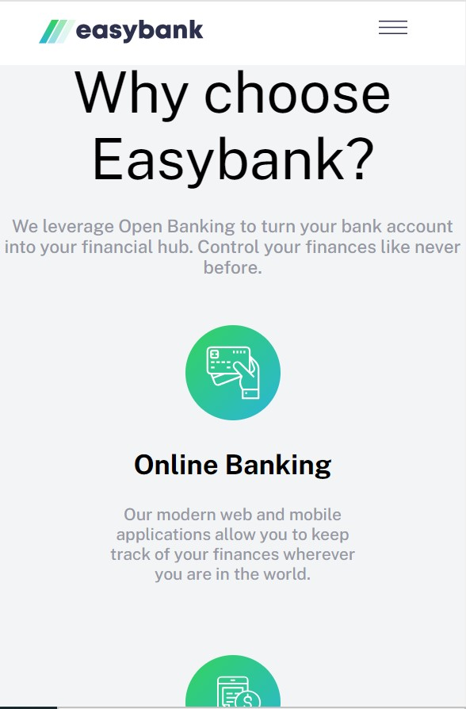
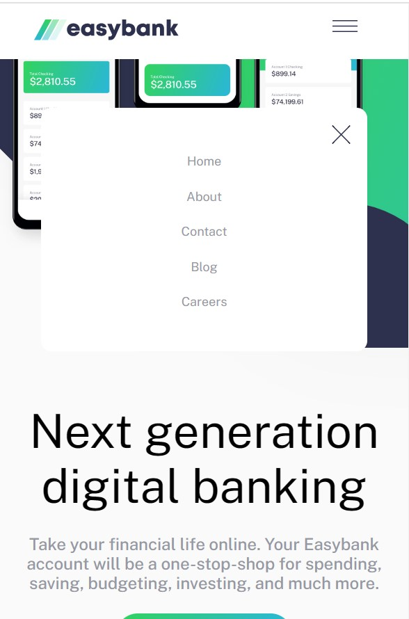

## PROJECT OVERVIEW

## Easy Bank Landing Page

 **A responsive landing page designed to provide an optimal user experience across various devices. Key features include:**

- **Responsive Design:** Adapts to different screen sizes, ensuring an ideal layout for desktop, tablet, and mobile devices.
- **Mobile Navbar Dropdown:** A dropdown menu for mobile views, enhancing navigation and accessibility.
- **Hover States:** Interactive elements feature hover states, providing visual feedback and enhancing user engagement.

This project showcases a user-friendly, device-agnostic landing page with interactive elements, ensuring a seamless experience for Easy Bank customers.

### Screenshot
.png)

### LINKS
- Solution URL:   https://github.com/yusfit/easybank
- Live Site URL:  https://yusfit.github.io/easybank/

### Built with
- Semantic HTML5 markup
- CSS custom properties
- Flexbox
- CSS Grid
- Javascript

## Author

- Linkedin - (https://www.linkedin.com/in/fesomu-yusuf)
- Twitter - (https://www.x.com/Yusfit123)

